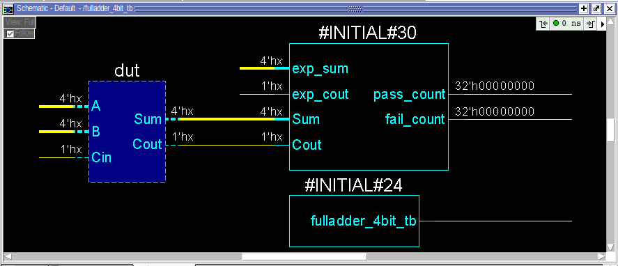
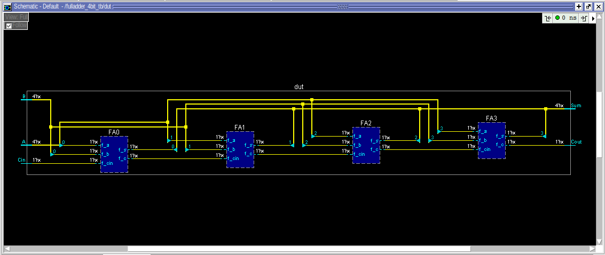
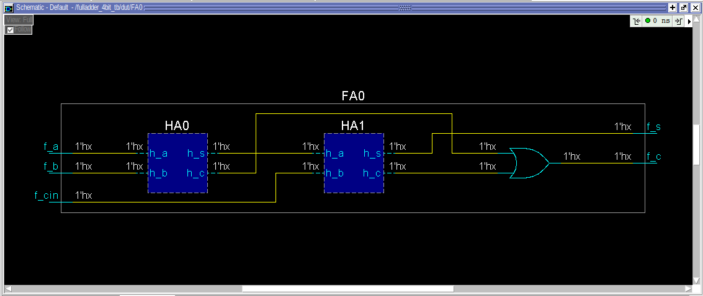
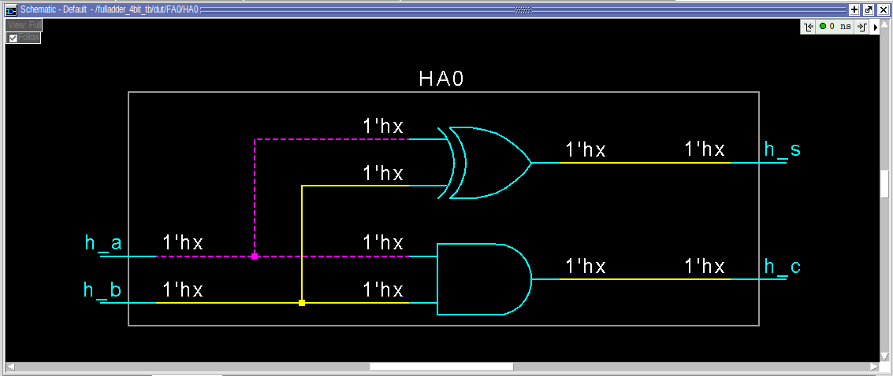
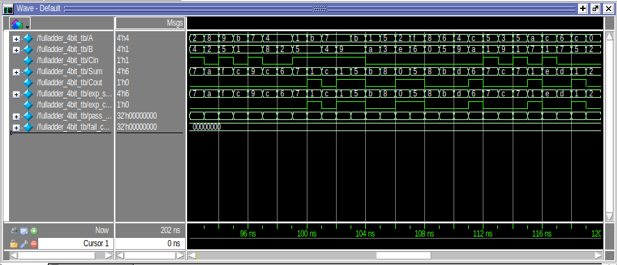

# Ripple Ccarry Adder – System Verilog Implementation

## 1. Overview

This project contains a complete System Verilog implementation of a **Ripple Carry adder**, including RTL design, testbench, simulation output, and theory resources.

A Ripple Carry Adder performs 4 bit two number addition:

This project is useful for students learning digital logic and HDL design.

---

## 2. Project Structure

```
ripplecarryadder/
├── scr/
│   ├── rtl/
│       └── fulladder_4bit.sv
│
├── sim/
│   ├── result/
|       ├──images/
|          └──4bitripple_FA0.png
|          └──4bitripple_HA0.png
|          └──4bitripple_schematic.png
|          └──4bitripple_schematic_block.png
|          └──4bitripple_waveform.png
│   ├── testbench/
|       └──fulladder_4bit_tb.sv
|
|
├── theory/
│   └── 4_bit_full_adder.png
│
└── README.txt
```

---

## 3. Included Images

### Block Diagram  


### Schematic  

### Block level Schematic


### Gate level Schematic



### Simulation Waveform  


---

## 4. File Descriptions

### 4.1 RTL Source  
**File:** `scr/rtl/fulladder_4bit.sv`  
Contains the System Verilog module implementing:


---

### 4.2 Testbench  
**File:** `sim/test/fulladder_4bit_tb.sv`  
Uses 200 random input combinations to verify the ripple carry adder and generate waveform output.

---

### 4.3 Simulation Files  
**Folder:** `sim/result`  
Contains: images of the simulation

- `4bitripple_waveform.png` → Simulation waveform
- `4bitripple_schematic_block.png` → Gate level Schematic
- `fulladder_4bit_tb.sv` → Schematic
---

### 4.4 Theory Documents  
**Folder:** `theory/`  
Includes schematic:

---


## 5. Purpose

This project demonstrates:

- Basic digital logic design
- Verilog RTL coding
- Testbench creation
- Simulation and waveform analysis
- Professional folder structure for HDL projects
- Binary addition
- Propagation delay in ripple adders
- Structural modeling in HDL
- Modular hardware design

---

## 6. Author

**Koustav Das**  
Electronics • Verilog • Digital Logic • Embedded Systems

---

## ⭐ If you find this helpful, please star the repository!
